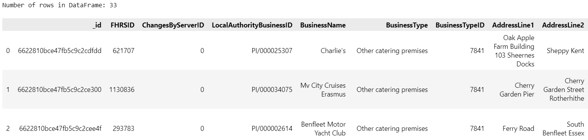
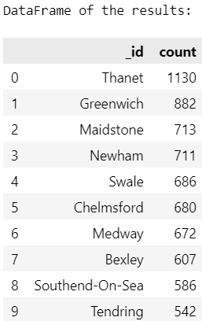

# Eat Safe, Love

The UK Food Standards Agency evaluates various establishments across the United Kingdom, and gives them a food hygiene rating. You've been contracted by the editors of a food magazine, Eat Safe, Love, to evaluate some of the ratings data in order to help their journalists and food critics decide where to focus future articles.

This project performs data preparation in MongoDB and then conducts analytics to find establishments by given criteria.

## Project Structure

The project is organized as follows:

- `Resources/`: 
  - `establishments.json`: A list of documents that describe almost 40k establishments across the UK. This file should be imported to MondoDB before running notebooks

- `NoSQL_setup.ipynb`: Jupyter notebook with data transformations required to update the database before analytics

- `NoSQL_analysis.ipynb`: Jupyter notebook with data analytics


## Installation

To set up this project locally, follow these steps:

### Prerequisites

Ensure you have the following installed:

- Python 3.11 or higher
- pip (Python package manager)
- Jupyter Notebook or JupyterLab (for running the notebook)

### Clone the Repository

Start by cloning the repository to your local machine:

```bash
git clone https://github.com/NataliiaShevchenko620/nosql-challenge.git
cd nosql-challenge
```

## Requirements

This project requires MongoDB and mongoimport utility installed.

This project requires the following Python packages:

- pymongo: For working with MongoDB.
- pandas: For data manipulation and analysis.

These dependencies can be installed using pip:

```bash
pip install pymongo pandas
```

## Usage

This project is divided into 3 main parts: data import, data preparation and data analysis. Here's how to use each component:

### Data import

From `Resources` directory run the following command to import establishments data to `uk_food` database of MongoDB:

```bash
mongoimport --type json -d uk_food -c establishments --drop --jsonArray establishments.json
```

### Data preparation

1. **Open the Notebook**:
    - Navigate to the project directory and launch Jupyter Notebook or JupyterLab:
      ```bash
      jupyter notebook
      # or
      jupyter lab
      ```
    - Open `NoSQL_setup.ipynb` from the Jupyter interface.

2. **Run the Notebook**:
    - Execute each cell in the notebook to perform data prepatations:
      - Import data about a new establishment "Penang Flavours"
      - Clean-up records related to estblishments in Dover
      - Update data types for `RatingValue` and `latitude/longitude` fields to int and decimals respectively to enable advanced search by those fields

### Data analysis

1. **Open the Notebook**:
    - Navigate to the project directory and launch Jupyter Notebook or JupyterLab:
      ```bash
      jupyter notebook
      # or
      jupyter lab
      ```
    - Open `NoSQL_analysis.ipynb` from the Jupyter interface.

2. **Run the Notebook**:
    - Execute each cell in the notebook to perform data analysis and get answers to the following questions:
      - 1. Which establishments have a hygiene score equal to 20?
      - 2. Which establishments in London have a `RatingValue` greater than or equal to 4?
  
          

      - 3. What are the top 5 establishments with a `RatingValue` rating value of 5, sorted by lowest hygiene score, nearest to the new restaurant added, "Penang Flavours"?
      - 4. How many establishments in each Local Authority area have a hygiene score of 0?

          


## License

This project is licensed under the MIT License - see the [LICENSE](LICENSE) file for details.


